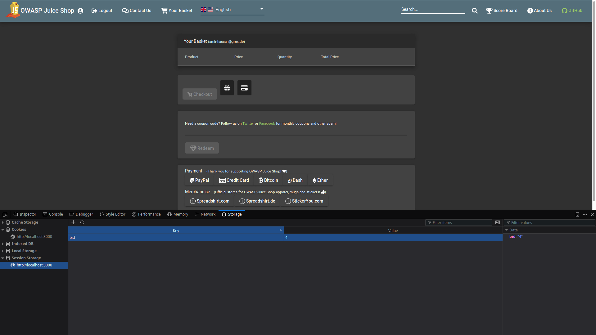

# Challenge Collection 1: Broken Access Control - Solutions

## Challenge 1.1: Find the Score Board with the challenge overview

Open the Web Developent Tool of your browser and select tab `Debugger` in Firefox or tab `Sources` in Chrome. Go to the sources of the file "main.js". There, you have the opportunity to search after a keyword by opening the search bar with STRG+F. For example, you are able to search after 'score'. If you go through the entire source, you will find this list of paths in the application:

As you can see, one of the paths is named `score-board`. So, you know that you have to browse to http://localhost:3000/#/score-board to solve the challenge.

After visiting the Score Board once, a button to return to the Score Board appears in the menu bar:

## Challenge 1.2: Find the Admin Page

In this case, it is the same procedure as in Challenge 1.1: Open `main.js` and search after something like `admin`. You will find a path named `administration`.
Browse to http://localhost:3000/#/administration to explore the administration section.

**Hint:** Make sure you have created an account before and are logged in. Otherwise, you won't see the entire content of the administration section.

## Challenge 1.3: Make sure that the shop loses all 5-Star ratings

After solving Challenge 1.2, go to the administration section. In the table "Customer Feedback", you have to delete the first entry of user `1` by clicking on the garbage can icon

## Challenge 1.4: Show the basket of another user

You have to be logged in (no matter, which user you are). In this case, the logged in account has been registered before via the register site.
Open the web development tool and select tab "Storage" in Firefox (In this case, Chrome users should switch, as the process is easier to manage in Firefox). Navigate to `Session Storage` --> `http://localhost:3000`.

There, you see the key `bid` with the value `4`. Change this value to another number, for example to `1`, and reload the site.

Now, there occur several products which have not been added before to the basket. So, the challenge is marked as approved.

If you want to know, which user added these products to the basket, have a look at the tab `Console` in the web development tool (Chrome users: Make sure that the option `Log XMLHttpRequests` is ticked).

There, you can see the GET call `http://localhost:3000/rest/basket/1`. Copy this statement in Postman and send a GET call.

This will lead to an Unauthorized Error, because the Authotization Header is missing. You need to get the token from the GET call. Go back to the console, expand the GET call and switch to tab "Cookies". There, you have to copy the value of "token". Then, you return to Postman, change the `TYPE` in tab "Authorization" to "Bearer Token" and paste the token in the input field.

As you can recognize, the`"Body` shows the names of the products which are displayed in the basket. The value of `UserId` is 1. If you remember the administration section, the first user in the list is has the email `admin@juice-sh.op`:

So, there is the opportunity that user 1 in the table has also UserId 1. To check, if this is true, you login with the email `admin@juice-sh.op` as soon as you recieve the password of this user or an possibility to avoid the password protection. As you don't know yet how to login with this email, you can limit your efforts to view this screenshot:

In the top, you can see the email `admin@juice-sh.op` next to the topic `Your Basket`. So now, the admin is logged in the application and regards his own basket
