# Challenge Collection 1: Broken Access Control - Solutions

   * [Challenge 1.1: Find the Score Board with the challenge overview](#challenge-11-find-the-score-board-with-the-challenge-overview)
   * [Challenge 1.2: Find the Admin Page](#challenge-12-find-the-admin-page)
   * [Challenge 1.3: Make sure that the shop loses all 5-Star ratings](#challenge-13-make-sure-that-the-shop-loses-all-5-star-ratings)
   * [Challenge 1.4: Show the basket of another user](#challenge-14-show-the-basket-of-another-user)
   * [Challenge 1.5: Write a comment in the name of another user:](#challenge-15-write-a-comment-in-the-name-of-another-user)
   * [Challenge 1.6: Change the description of the product OWASP SSL Advanced Forensic Tool (O-Saft)](#challenge-16-change-the-description-of-the-product-owasp-ssl-advanced-forensic-tool-o-saft)

## Challenge 1.1: Find the Score Board with the challenge overview

Open the Web Developent Tool of your browser and select tab `Debugger` in Firefox or tab `Sources` in Chrome. Go to the sources of the file `main.js`. There, you have the opportunity to search after a keyword by opening the search bar with `STRG+F`. For example, you are able to search after `score`. If you go through the entire source, you will find this list of paths in the application:  
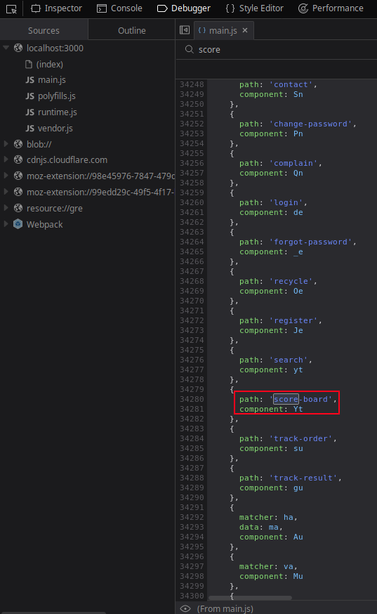  

As you can see, one of the paths is named `score-board`. So, you know that you have to browse to http://localhost:3000/#/score-board to solve the challenge.

After visiting the Score Board once, a button to return to the Score Board appears in the menu bar:  
  

## Challenge 1.2: Find the Admin Page

In this case, it is the same procedure as in Challenge 1.1: Open the Web Developent Tool and select tab `Debugger` (Firefox) or `Sources` (Chrome). Open `main.js` and search after something like `admin`. You will find a path named `administration`:

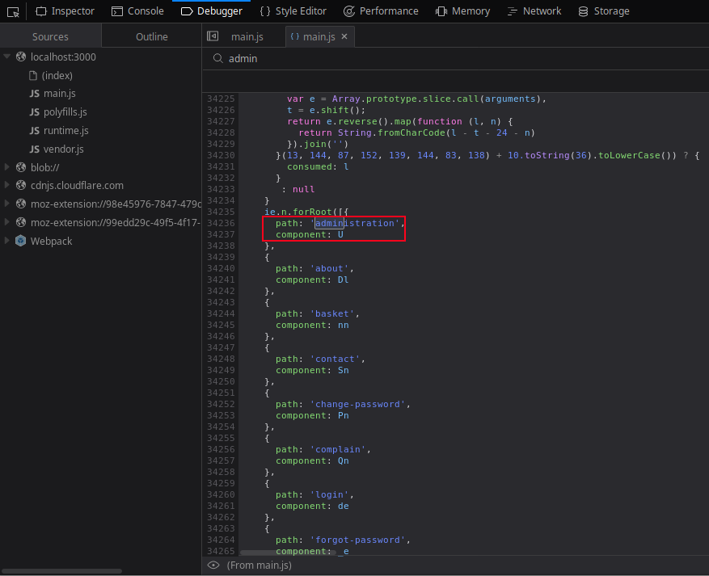  

Browse to http://localhost:3000/#/administration to explore the administration section.

**Hint:** Make sure you have created an account before and are logged in. Otherwise, you won't see the entire content of the administration section.

## Challenge 1.3: Make sure that the shop loses all 5-Star ratings

After solving [Challenge 1.2](https://github.com/nt-ca-aqe/thesis-ahs/tree/master/Challenge%201:%20Broken%20Access%20Control#challenge-12-find-the-admin-page), go to the administration section. In the table `Customer Feedback`, you have to delete the first entry of user `1` by clicking on the garbage can icon:
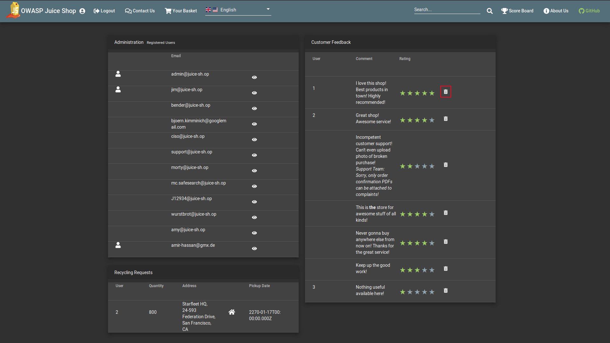  

## Challenge 1.4: Show the basket of another user

You have to be logged in (no matter, which user you are). In this case, the logged in account has been registered before via the register site.
Open the web development tool and select tab "Storage" in Firefox (In this case, Chrome users should switch, as the process is easier to manage in Firefox). Navigate to `Session Storage` --> `http://localhost:3000`.  
  

There, you see the key `bid` with the value `4`. Change this value to another number, for example to `1`, and reload the site.  
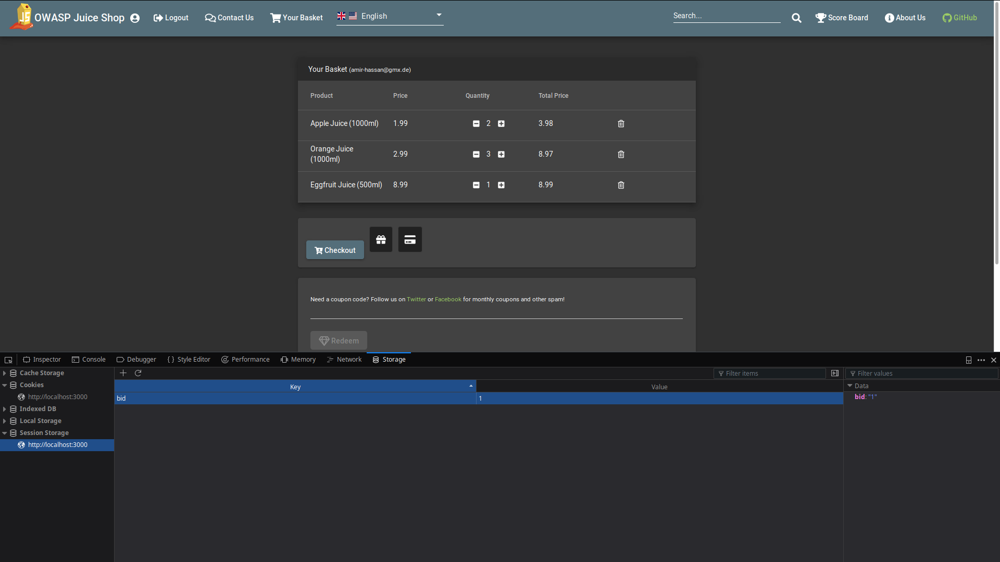  
Now, there occur several products which have not been added before to the basket. So, the challenge is marked as approved.

If you want to know, which user added these products to the basket, have a look at the tab `Console` in the web development tool.  
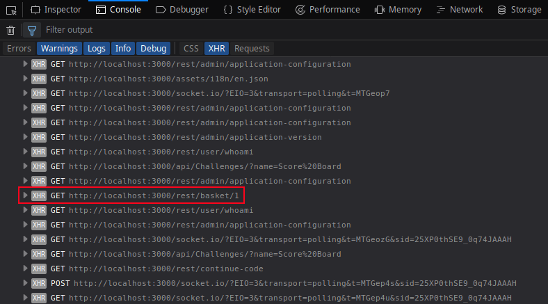  

There, you can see the GET call `http://localhost:3000/rest/basket/1`. Copy this statement in Postman and send a GET call.  
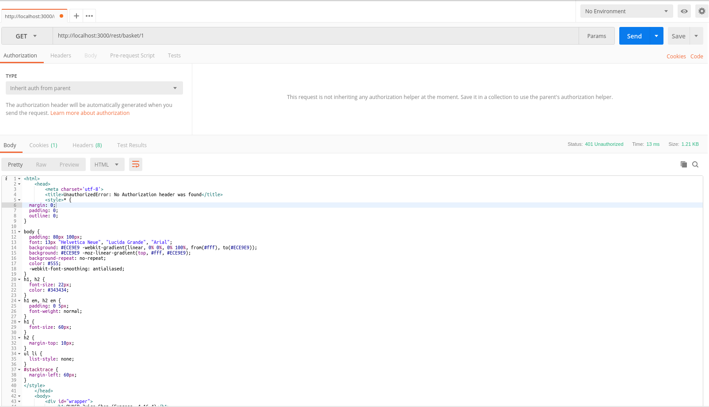  

This will lead to an Unauthorized Error, because the Authotization Header is missing. You need to get the token from the GET call. Go back to the console, expand the GET call and switch to tab `Cookies`:  

  

There, you have to copy the value of "token". Then, you return to Postman, change the `TYPE` in tab `Authorization` to "Bearer Token" and paste the token in the input field.  
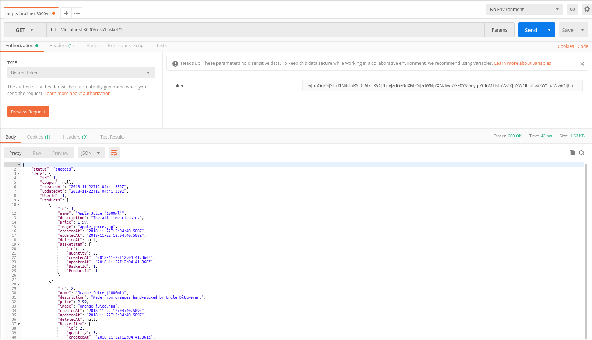  

As you can recognize, the `Body` shows the names of the products which are displayed in the basket. The value of `UserId` is 1. If you remember the administration section, the first user in the list has the email `admin@juice-sh.op`:

So, there is the opportunity that user 1 in the table has also UserId 1. To check, if this is true, you login with the email `admin@juice-sh.op` as soon as you recieve the password of this user or an possibility to avoid the password protection. As you don't know yet how to login with this email, you can limit your efforts to view this screenshot:  
  
In the top, you can see the email `admin@juice-sh.op` next to the topic `Your Basket`. So now, the admin is logged in the application and regards his own basket.

## Challenge 1.5: Write a comment in the name of another user:
Browse to http://localhost:3000/#/contact.
Open the web development tool and navigate to tab "Inspector" in Firefox or "Elements" in Chrome:
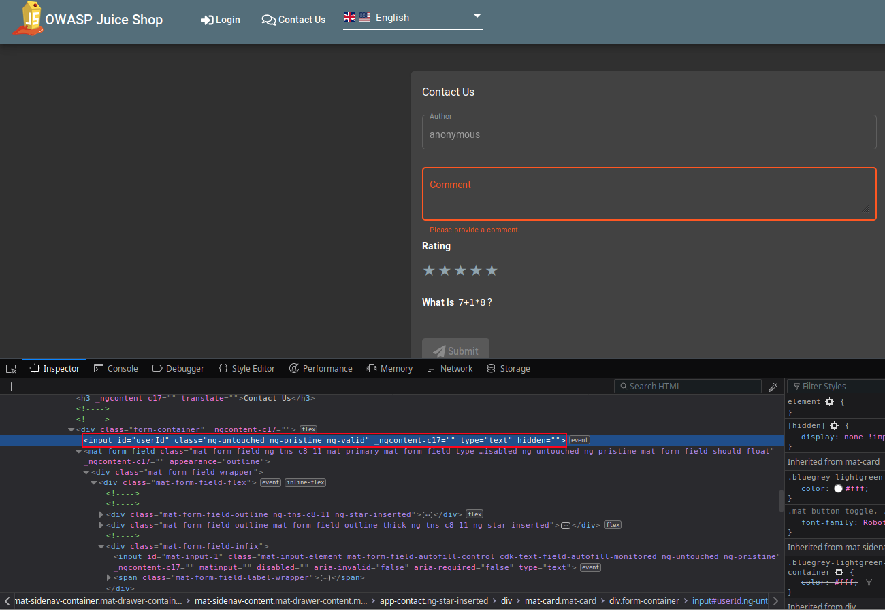  
You will find the input field with the id `userId`. This field includes the attribute `hidden`. Edit the source and remove this attribute.
After editing the source, an input field appears above the `Author`:

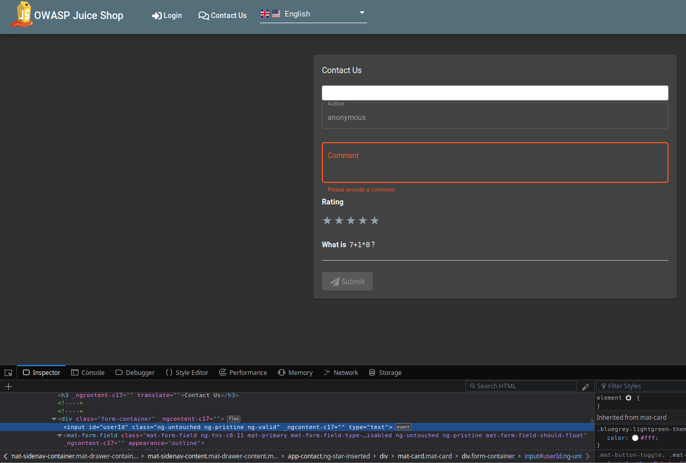  

Fill in a `1` in this field, as the administrator of the juice shop has this UserId (You will know this fact if you have solved [Challenge 1.4](https://github.com/nt-ca-aqe/thesis-ahs/tree/master/Challenge%201:%20Broken%20Access%20Control%20-%20Solutions#challenge-14-show-the-basket-of-another-user) before). Complete the remaining input fields and submit your comment:

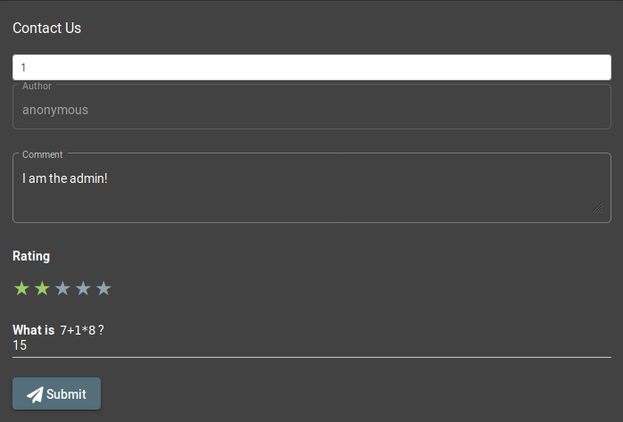  

To show the submitted comment, have a look at the `Console` tab of the web development tool:

  

You recognize the POST call `http://localhost:3000/api/Feedbacks`. Type this in your browser and you will receive all entries in the `Contact us` section, including your comment in the bottom of the table with `UserId 1`:

  

## Challenge 1.6: Change the description of the product "OWASP SSL Advanced Forensic Tool (O-Saft)"

Type `OWASP SSL Advanced Forensic Tool (O-Saft)` in the search bar and open the product information while capturing the HTTP traffic in the `console` of the web development tool.  

  

The `console` shows the following output:  

  

So, the GET call `http://localhost:3000/rest/product/9/reviews` reveals that the product OWASP SSL Advanced Forensic Tool (O-Saft) has the ID `9`.  
You need to interact with the API. To find out the right path to manipulate the products, switch in the development tool to tab `Debugger` in Firefox or tab `Sources` in Chrome and search within the file `main.js` after the all entries that contains the keyword `api`.  
  
This search will show the path `api/Products`. Also, you can recognize the path `/rest/product/search?q=`. Browse to `http://localhost:3000/rest/product/search?q=`:  
  
In this way, you get a list of all products in the juice shop. The advantage of this schema is that it shows the parameter you need to replace is named `description`. You only have to copy the snippet `<a href=\"https://www.owasp.org/index.php/O-Saft\" target=\"_blank\">More...</a>` and replace the URL to `http://kimminich.de`.  
Open [Postman](https://www.getpostman.com/apps) and send a PUT request to `http://localhost:3000/api/Products/9` with `{"description": "<a href=\"http://kimminich.de\" target=\"_blank\">More...</a>"}` as body. Make sure that you have selected `JSON (application/json)`:  
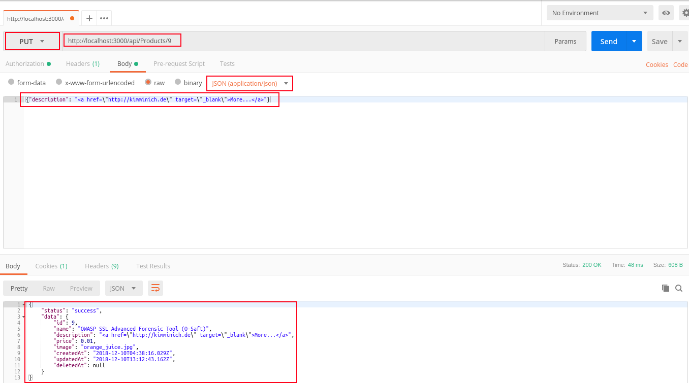  
Repeating the search after `OWASP SSL Advanced Forensic Tool (O-Saft)` will present the new description with the new link:  
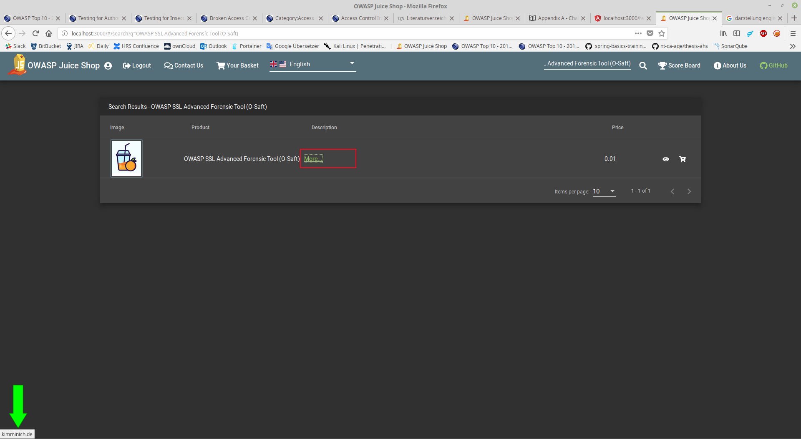  

