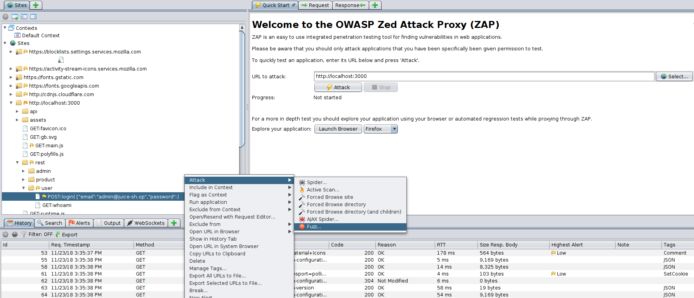
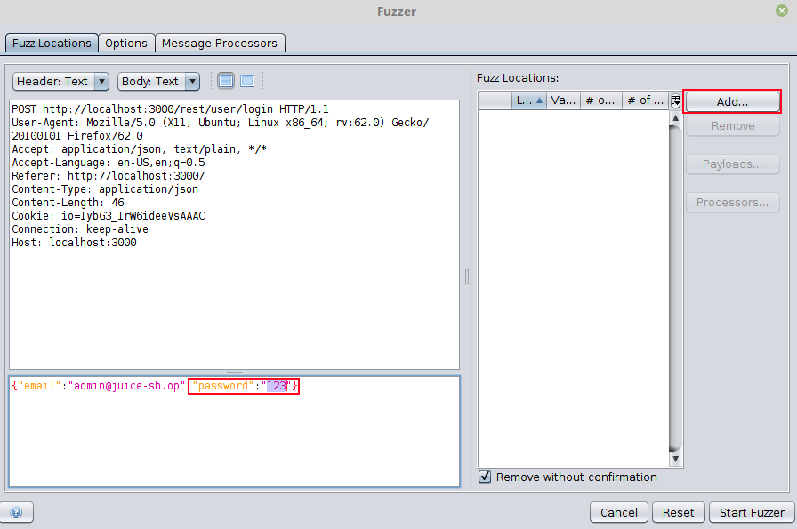
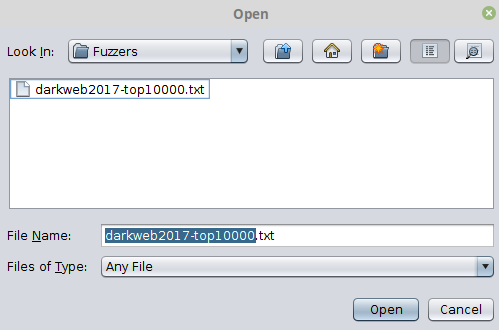
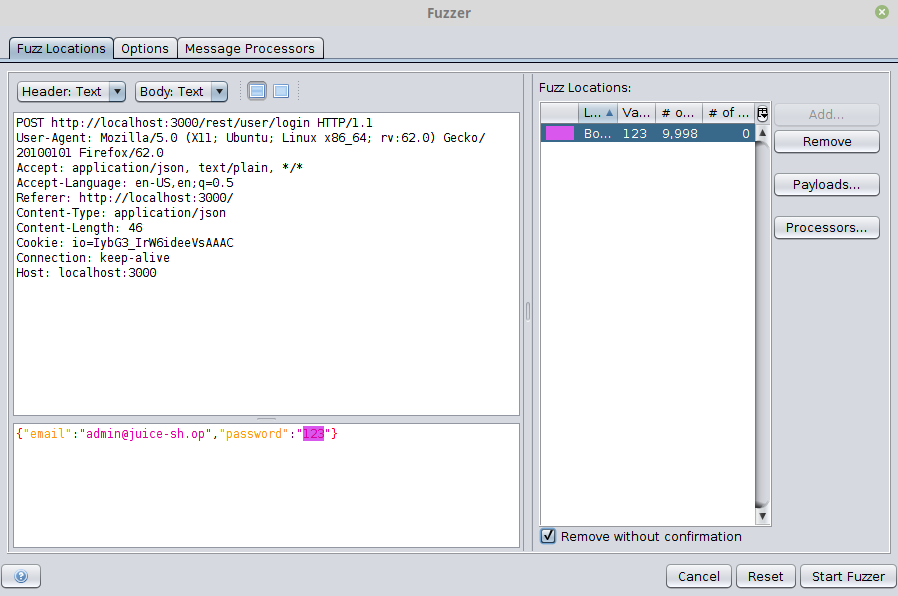
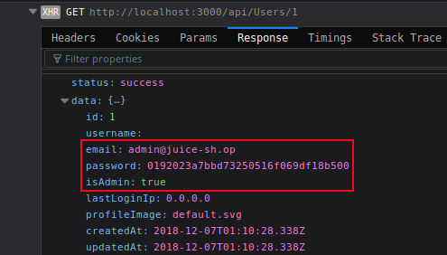
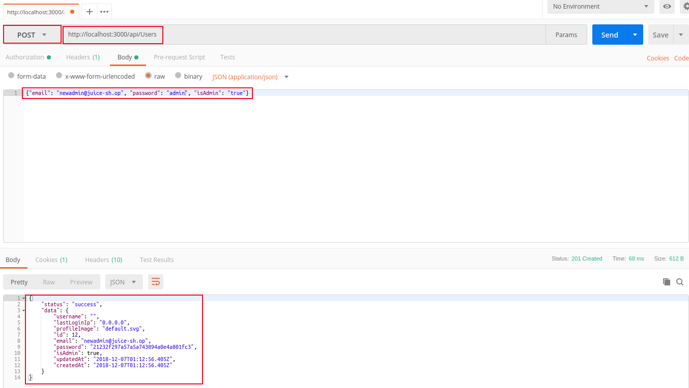
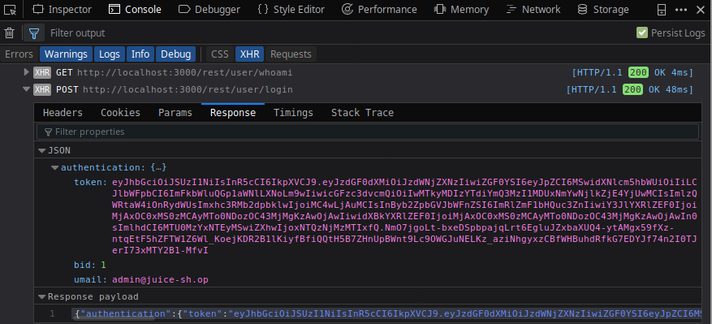
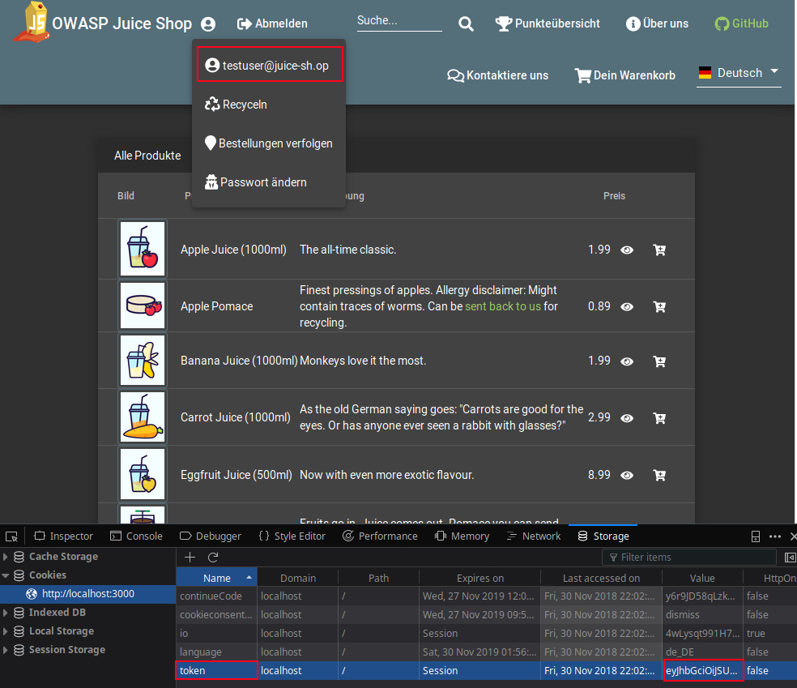
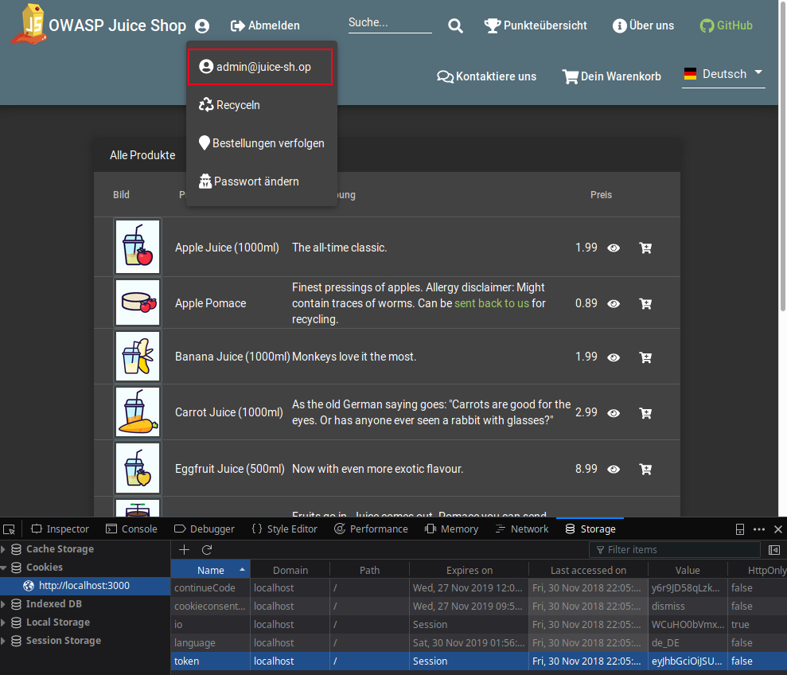

# Challenge Collection 3: Broken Authentication - Solutions

   * [Challenge 3.1: Brute-force attack](#challenge-31-brute-force-attack)
   * [Challenge 3.2: Create an administrator account](#challenge-32-create-an-administrator-account)
   * [Challenge 3.3: Take over the session of a previously logged in user](#challenge-33-take-over-the-session-of-a-previously-logged-in-user)

## Challenge 3.1: Brute-force attack

[Install OWASP ZAP](https://github.com/zaproxy/zaproxy/wiki/Downloads).

Open OWASP ZAP. In the field `URL to attack`, fill in the URL of Juice Shop and click the `Launch Browser`-Button.  
  

In this browser, you go to http://localhost:3000/#/login and attempt a login with the email of the admin. Type `admin@juice-sh.op` in the email field, a random input in the password field and click the `Log in`-Button  
  

In this way, you cause a POST call on the REST API. Go back to OWASP ZAP and expand the `http://localhost:3000` folder in the `Sites` tab:  

  
You will see, that the last POST call is monitored there. Right click the POST call and choose `Attack` --> `Fuzz...`:  
  

In the window `Fuzzer`, mark the password (in this case `123`) that you have chosen for your login attempt as this is the parameter that should be replaced. In the area `Fuzz Locations:`, click on `Add...`:  
  

In the window "payloads", click again on `Add...`:  
  

In the window "Add Payload", change the `Type` to file, click at `Select...` and choose a wordlist from your local drive:  
  

For example, you can get the file `darkweb2017-top10000` from https://github.com/danielmiessler/SecLists/tree/master/Passwords:  
  

After adding the file, you can see a preview of the words in your textfile:  
  

Click on `Add` and confirm the `Payloads` window with `OK`.
Your `Fuzzer` window should look like this:  
  

Now, you are ready to click on `Start Fuzzer`.
While Fuzzering, you will receive lots of passwords that lead to the status `Unauthorized`:  
  

Sort after the column "Code" or `Reason` and you see a row with one `OK` result. The column `Payloads` presents the password for the email `admin@juice-sh.op`: `admin123`.  

## Challenge 3.2: Create an administrator account

Install [Postman](https://www.getpostman.com/apps).  

Log in with your own account or with the admins account (described in challenges [2.1](https://github.com/nt-ca-aqe/thesis-ahs/tree/master/Challenge%202:%20Injection#challenge-21-log-in-as-administrator) and [3.1](LINK)).
Browse to http://localhost:3000/#/administration, open the console of the web development tool and click on any eye icon next to the emails.  
  
In the console, you will see the GET-request `http://localhost:3000/api/Users/1` that reveals you an opportunity to interact with the API. Switch to tab `Response` to see the name of the parameters you have to pass:  
  
Open Postman. Fill in `http://localhost:3000/api/Users` (note, that you don't pass the id `1` in this case) as POST-request. Switch to tab `Body` and choose `JSON (application/json)`. There, you have to fill in something like `{"email": "newadmin@juice-sh.op", "password": "admin", "isAdmin": "true"}`. After sending this POST-request, your Postman window should look like this:  

## Challenge 3.3: Take over the session of a previously logged in user

Make sure that the option `Persist Logs` is ticked in the console of the web development tool. So, you can browse through the Juice Shop without the need of having the web development tool open to capture the GET- and POST-requests.  
  

In this case, the admin account with the email the email `admin@juice-sh.op` is the previously logged in user. Log in with his credentials (described in challenges [2.1](https://github.com/nt-ca-aqe/thesis-ahs/tree/master/Challenge%202:%20Injection#challenge-21-log-in-as-administrator) and [3.1](LINK)) and log out again.  
Log in with another account, for example your own account. In this case, the email of this account is `testuser@juice-sh.op`  
Open the console and extend a GET- or POST-request caused by the admin account. In this example, the POST call `http://localhost:3000/rest/user/login` has been expanded:  
  
In tab `Response`, the session token and is shown. Also, the row `umail` reveals that the session token belongs to the admin's account. Copy the session token and switch to tab `Storage` (Firefox) of the web development tool:

  
As you can see at the top, the currently active session is `testuser@juice-sh.op`. Now expand the section `Cookies` and click on `http://localhost:3000`. In the row `token`, replace the content of the column `Value` with the previously copied session token and reload the browser.

  
As you now see at the top, the session of `admin@juice-sh.op` has been restored without using the user credentials.

