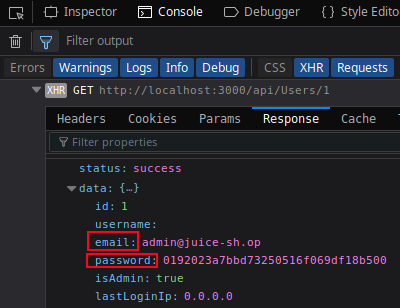
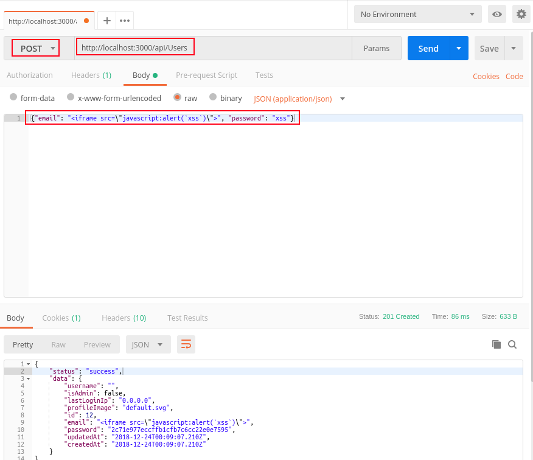
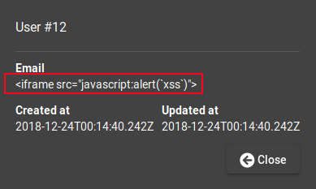
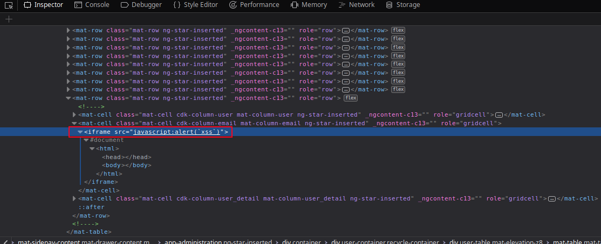
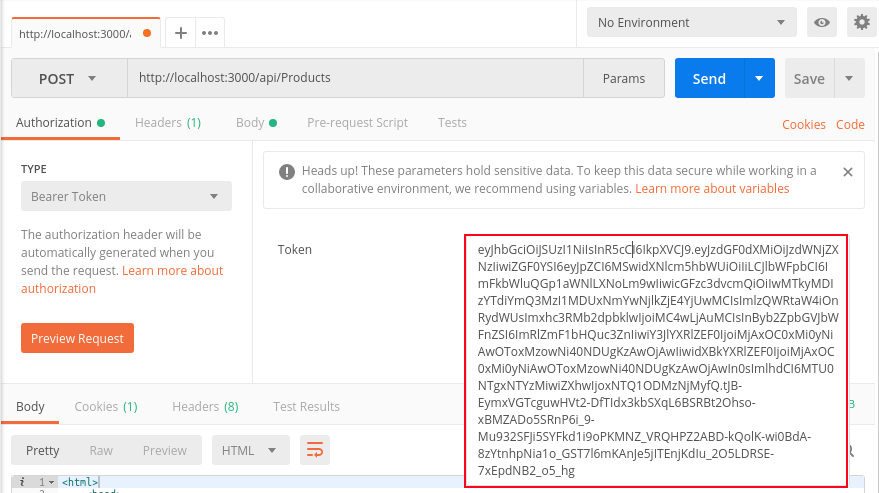
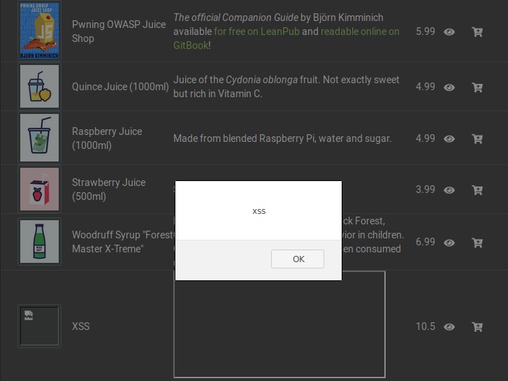
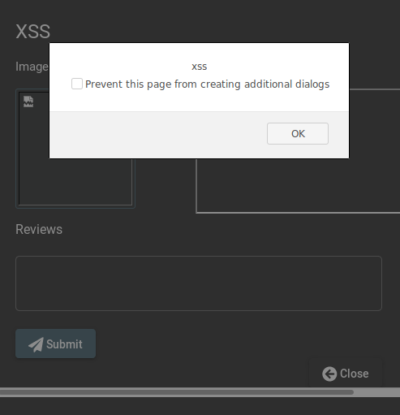
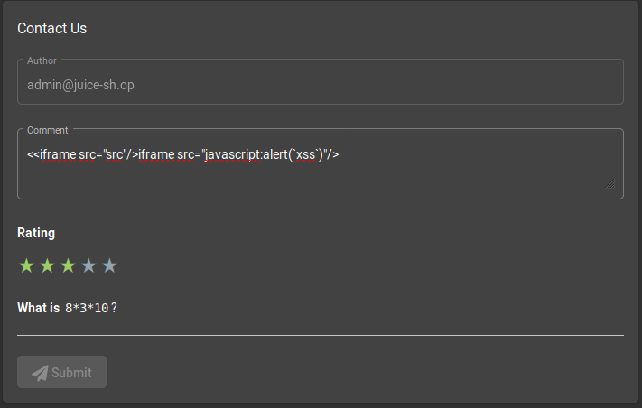
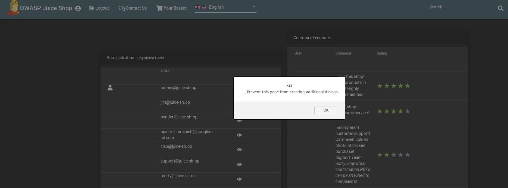
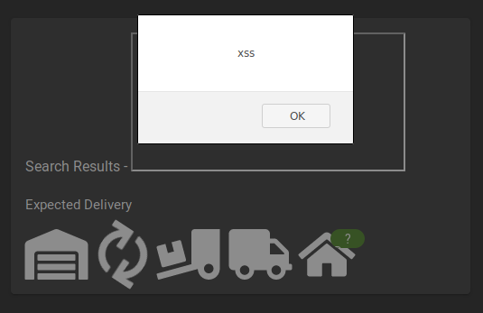

# Challenge Collection 5: Cross-Site Scripting (XSS) - Solutions

## Challenge 5.1: Persisted XSS with Postman
For Postman, you need to find out how to interact with the users API. Log in with your own account or with the administrator's account (described in [Challenge 3.1](https://github.com/nt-ca-aqe/thesis-ahs/tree/master/Challenge%203:%20Injection#challenge-31-log-in-as-administrator).  
By navigating to the admin section `http://localhost:3000/#/administration`, you will see the list of all users.
  
Open the tab `console` of the web development tool of your browser. Afterwards, click on the eye icon of any user to open the user's information. You will recognize a GET call in the console:
  
The GET call `http://localhost:3000/api/Users/1` reveals that you can interact with the API by sending a request to `http://localhost:3000/api/Users`. In addition, the tab `Response` of the GET call shows you several parameters, that belong to the user object.  
You have to create a new user entry by submitting a body with an email and a password, as this attributes are needed for a valid user. Fill in the input fields in Postman as shown here:  
  
Consider that you have to escape the `"` character in the body. So, the submitted body is <code>{"email": "<iframe src=\"javascript:alert(&grave;xss&grave;)\"/>", "password": "xss"}</code>. Make sure you choose `JSON(application/json)` and send this as a POST request to `http://localhost:3000/api/Users`. The request leads to a success and shows the body of the new user.  
Refresh the admin section:
  
You see that a dialog with the content `xss` pops out. Also, you see a new empty line in the user list with the iframe element. Clicking on the eye icon of this new line opens the user information:  

  
There, you see the submitted email: <code><iframe src="javascript:alert(&grave;xss&grave;)"/></code>.  

Checking the tab `Inspector` will show you that the iframe element has become a part of the HTML code:
  

## Challenge 5.2: Persisted XSS with Postman 2
[Challenge 1.6](https://github.com/nt-ca-aqe/thesis-ahs/tree/master/Challenge%201:%20Broken%20Access%20Control#challenge-16-change-the-description-of-the-product-owasp-ssl-advanced-forensic-tool-o-saft) has shown you that you have the oppurtunity to interact with the products API via `http://localhost:3000/api/Products`. Also, browsing to this URL shows you the following information:
  
To create a new product, you have to fill the parameters `name`, `description` and `price` with values.  
Before, you need to obtain the session token by loggging in the application with any account and extracting the information from any GET call. To show the GET call, open the web development tool, choose the tab `console` and switch to tab `Cookies` of the GET call:  

  

After copying the session token, you can start Postman. Insert the token:

  
Then, send a POST request to `http://localhost:3000/api/Products` with <code>{"name": "XSS", "description": "<iframe src=\"javascript:alert(&grave;xss&grave;)\"/>", "price": 10.50}</code> as body. Make sure that you escape the `"` character and that you choose `JSON(application/json)`:

  
The request leads to a success. Go to the product list of the juice shop. By switching to the site, that contains the new product, you will see a dialog with the content `xss` popping out:

  
Also, you will recognize a new line with the name `XSS`, an empty iframe as description and the price `10.50`. If you click on the eye icon of this empty line, you will see the following result:

  
While opening the product info, the dialog with the content `xss` pops out again.

## Challenge 5.3: Persisted XSS through the UI
Browse to `http://localhost:3000/#/contact`. You need to modify the iframe element, as the common input <code><iframe src="javascript:alert(&grave;xss&grave;)"/></code> wouldn't be parsed in the HTML code as you need. Instead, type in the following: <code><<iframe src="src"/>iframe src="javascript:alert(&grave;xss&grave;)"/></code>
  
Submit the comment and browse to the `About us` section: `http://localhost:3000/#/about`
  
The administration section will show you the same result: `http://localhost:3000/#/administration`
  

## Challenge 5.4: Reflected XSS
Browse to `http://localhost:3000/#/track-order`. Type in <code><iframe src="javascript:alert(&grave;xss&grave;)"></code>.
  
Submit your input:
  
The dialog with the content `xss` pops out. In addition, you see the iframe element in the background as search result.  
In the tab `Inspector` (Firefox) or `Elements` (Chrome) of the web development tool, you will see that the iframe element with the javascript function has become a part of the HTML sources:
  

## Challenge 5.5: DOM XSS
Fill the input field for the product search with <code><iframe src="javascript:alert(&grave;xss&grave;)"></code> and submit this request:
  
The dialog with the content `xss` pops out. In addition, you see the iframe element in the background as search result.  

