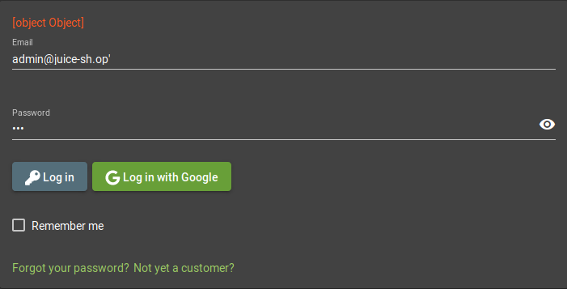
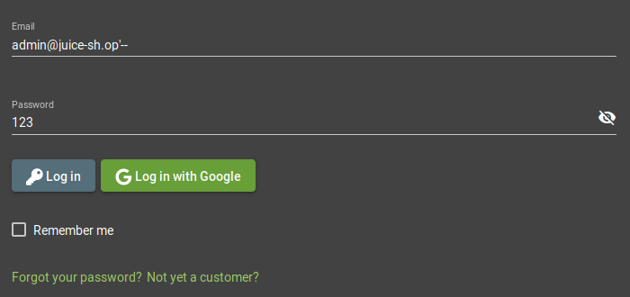
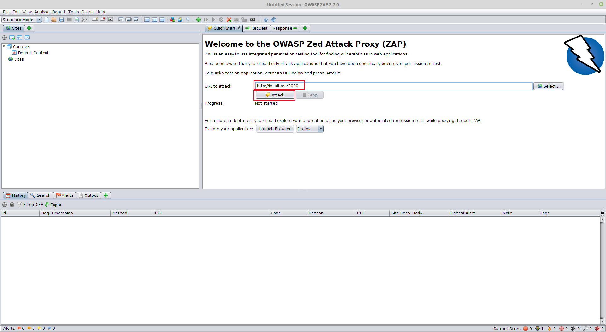
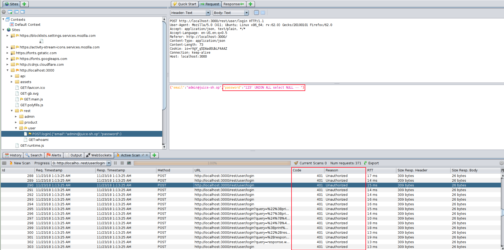
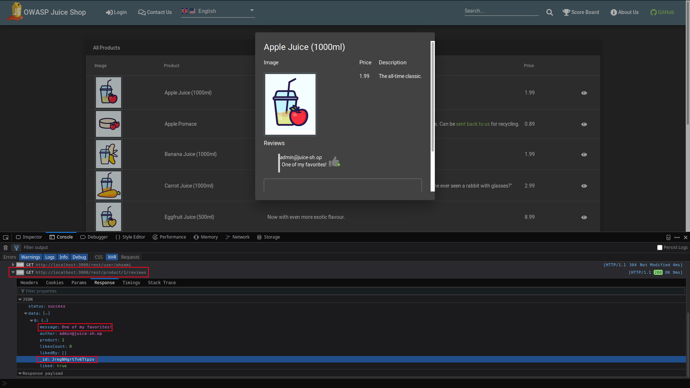
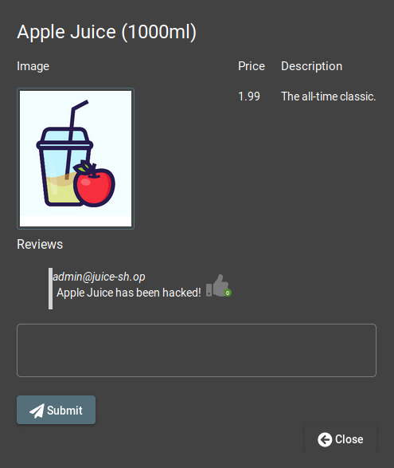
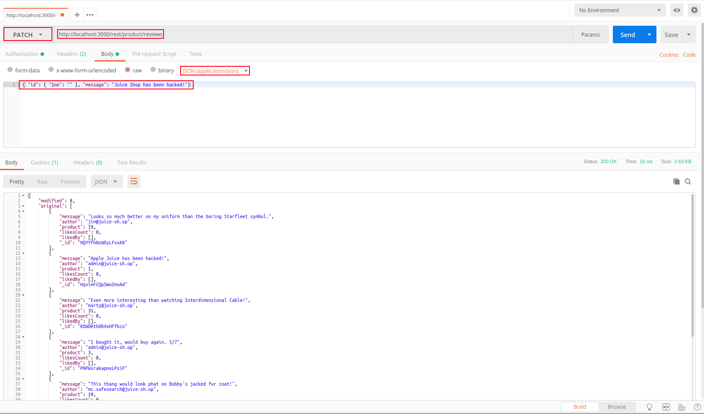
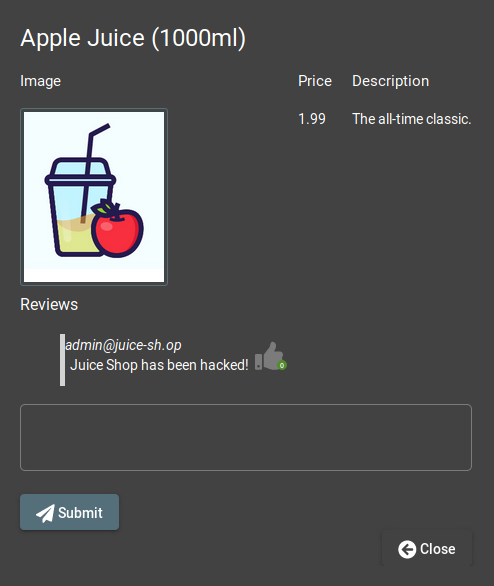
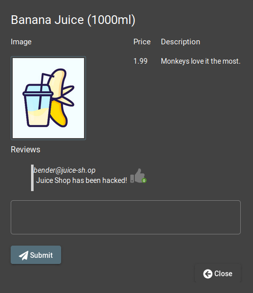

# Challenge Collection 3: Injection - Solutions

   * [Challenge 3.1: Log in as administrator](#challenge-31-log-in-as-administrator)
      * [Variant 1: Causing an internal server error by inserting invalid input](#variant-1-causing-an-internal-server-error-by-inserting-invalid-input)
      * [Variant 2: Scanning the juice shop with OWASP ZAP](#variant-2-scanning-the-juice-shop-with-owasp-zap)
   * [Challenge 3.2: Modify a product review](#challenge-32-modify-a-product-review)
   * [Challenge 3.3: Modify multiple product reviews at once](#challenge-33-modify-multiple-product-reviews-at-once)
   * [Challenge 3.4: Cause the server of the juice shop to sleep for 2 seconds](#challenge-34-cause-the-server-of-the-juice-shop-to-sleep-for-2-seconds)

## Challenge 3.1: Log in as administrator
### Variant 1: Causing an internal server error by inserting invalid input
Provoke an error by crashing the application with the input `admin@juice-sh.op'` and any password.  

  

There occurs an error `[object Object]`. If you look at the `console`, you will recieve more information  
  

There you can recognize the underlying **NoSQL** query in the row `sql`: `SELECT * FROM Users WHERE email = 'admin@juice-sh.op'' AND password = '202cb962ac59075b964b07152d234b70'`. As a consequence of the two apostrophes following the email, the statement now is corrupted. The rest of the statement after the email can be commented out with two hyphen `--`. So, the password won't be compared with the entry in the database.  
  
With `admin@juice-sh.op'--` as input and any password, you can access the administrator's account.

### Variant 2: Scanning the juice shop with OWASP ZAP
[Install OWASP ZAP](https://github.com/zaproxy/zaproxy/wiki/Downloads).  
Open **OWASP ZAP**. In the field `URL to attack`, fill in the URL of **OWASP Juice Shop** and click the `Launch Browser`-Button.  
  

In this browser, you go to `http://localhost:3000/#/login` and attempt a login with the email of the admin. Type `admin@juice-sh.op` in the **email field**, a random input in the **password field** and click the `Log in` Button  
  
In this way, you cause a **POST** call on the **REST API**. Go back to **OWASP ZAP** and expand the `http://localhost:3000` folder in the `Sites` tab:  
  
You will see, that the last **POST** call is monitored there. Right click the **POST** call and choose `Attack` --> `Active Scan..`:  
  
Confirm the dialog with `Start Scan`:  
  

**OWASP ZAP** attempts to log in the application by changing several parameters in the **POST** call that you made before with your login attempt. In this case, the password has been replaced:  
  
As you can see, there are numerous attempts with the result `Unauthorized`. By sorting the `Code` or `Reason` column, a few calls with status `OK` are shown.  
  
You see the parameters that lead to a successful login: `admin@juice-sh.op' AND '1'='1' --` as email input and `123` as password input.

## Challenge 3.2: Modify a product review
Open the **Web Development Tool** and select the tab `Console`.
Open the product information for `Apple Juice (1000 ml)`. You will receive the **GET** call `http://localhost:3000/rest/product/1/reviews`. Select the tab `Response` (**Firefox**) of the **GET** call to see the given parameters:
  

Open **Postman** and type `http://localhost:3000/rest/product/reviews` as link (note that you have to remove the `1` from the original **GET** call).
As you found out from the `console`, the id of the message you want to attack in this case is `JregNHgrt7v6Ttpzv`. So, this must appear in your body, as this is the only message you want to modify. Your body should look like this:
``{ "id": "JregNHgrt7v6Ttpzv", "message": "Apple Juice has been hacked!"}``.  
Check if you have chosen `JSON (application/json)` as type:

  
`Send` this as a **PATCH** call.
Opening the product information again shows the wanted comment:
  

## Challenge 3.3: Modify multiple product reviews at once
Similar to [Challenge 3.2](#challenge-32-modify-a-product-review), you need to insert `http://localhost:3000/rest/product/reviews` in **Postman**.
You have to replace the old input for the `id` with `{ "$ne": "" }`, because `ne` is the `not equal` operator. As you want to update **all** product reviews, `ne=""` will match every time because there is no id with an empty string.
Adjust the message to `Juice Shop has been hacked!`, make sure you have selected `JSON (application/json)` and `Send` the **PATCH** call with the body:
``{ "id": { "$ne": "" }, "message": "Juice Shop has been hacked!"}``

  

A look at several products shows that reviews from different users has changed to the wanted message:  

  
  

## Challenge 3.4: Cause the server of the juice shop to sleep for 2 seconds
Open any product information while observing the console of the **Web Development Tool**. You see the **GET** call `http://localhost:3000/rest/product/1/reviews`, which holds an opportunity for injecting the sleep function:  

  

Call `http://localhost:3000/rest/product/sleep(2000)/reviews`. You see that the browser will load longer before showing this **JSON** response:  

